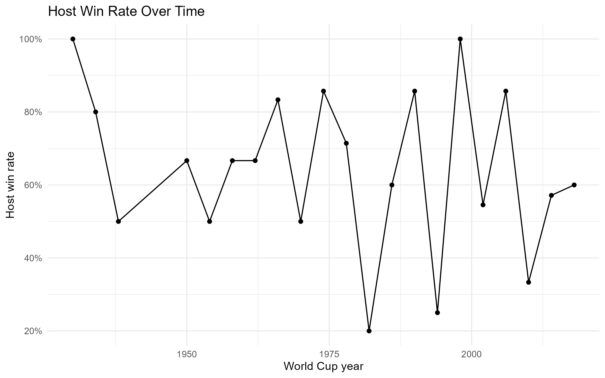

# FIFA World Cup Data Analysis

This project explores historical FIFA World Cup data to examine which countries have been the most successful, whether host nations have an advantage, and how scoring has changed over time.

## Key Findings

Brazil has been the most successful World Cup nation with **5 titles**, followed by Germany and Italy with **4 each**. Hosting also appears to provide a significant advantage: host nations won **68.75%** of their matches compared with **39.03%** for non-host teams. Even after accounting for historical team strength, hosts had about **3.1 times the odds of winning**. 

## Host Advantage

## Full Report

[View the full World Cup analysis](PASTE-LIVE-REPORT-LINK-HERE)

## Data Source

* **TidyTuesday:** https://github.com/rfordatascience/tidytuesday
* **Dataset:** https://github.com/rfordatascience/tidytuesday/tree/main/data/2022/2022-11-29

#TidyTuesday #RStats #DataVisualization #WorldCup
