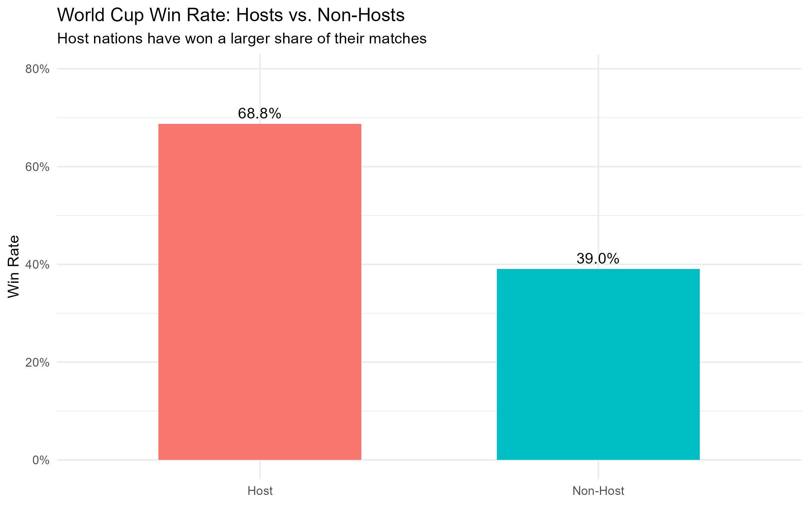
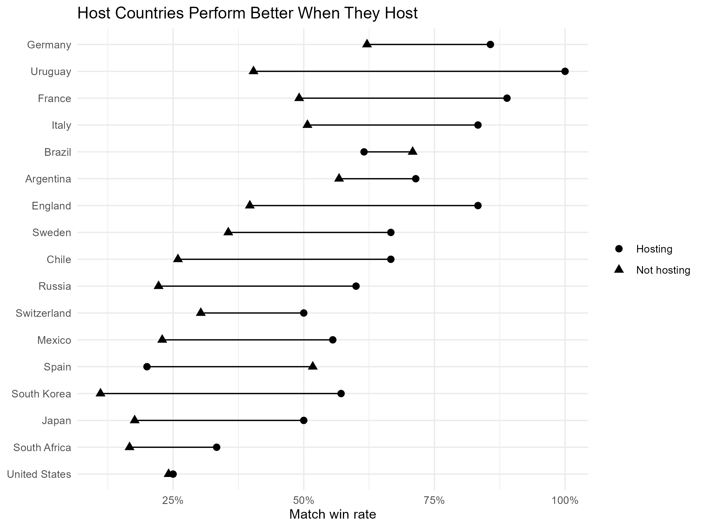

# FIFA World Cup Data Analysis

This project explores historical FIFA World Cup data to examine which countries have been the most successful, whether host nations have an advantage, and how scoring has changed over time.

## Key Findings

Brazil has been the most successful World Cup nation with **5 titles**, followed by Germany and Italy with **4 each**.

Hosting also appears to provide a significant advantage. Host nations won **68.75%** of their matches compared with **39.03%** for non-host teams. Even after accounting for historical team strength, hosts had about **3.1 times the odds of winning**.

## Host vs. Non-Host Performance

Host nations had a substantially higher match win rate than non-host nations. While this provides evidence of a host advantage, some of the difference could be explained by historically strong soccer nations also being selected as hosts.

## Do Countries Perform Better When They Host?

Comparing countries against their **own performance when not hosting** provides stronger evidence of a host advantage. Most countries had a higher match win rate when hosting the World Cup than when playing in World Cups hosted elsewhere.

Countries such as Uruguay, England, Sweden, South Korea, France, and Italy showed noticeable improvements when hosting. However, the advantage was not universal, showing that hosting can help but does not guarantee success.

## Full Report

[View the full World Cup analysis](PASTE-LIVE-REPORT-LINK-HERE)

## Data Source

* **TidyTuesday:** https://github.com/rfordatascience/tidytuesday
* **Dataset:** https://github.com/rfordatascience/tidytuesday/tree/main/data/2022/2022-11-29

#TidyTuesday #RStats #DataVisualization #WorldCup 
